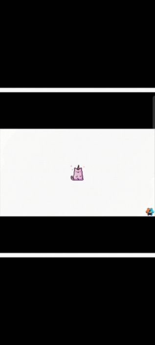

# Defold Web Mobile Gestures Starter

## Join The Room 606!
> 
>
> 🦄 Come join our friendly 🇷🇺 ru-speaking community in `Telegram`: [@TheRoom606](https://t.me/TheRoom606)
> 
> A chat: https://t.me/TheRoom606Chat

## Description:
This `Defold` game project represents basic setup of commonly used user interactions functionality required in wide range of games: Hidden Object Games, RTS, RPG, Action/Quest etc.

Project covers both Desktop and Web Mobile Platforms.

🎮 **[Play Demo Here](https://zugzug90.github.io/web-mobile-gestures-starter/)**

## Project Dependencies and Prerequisits
1. Project uses [orthographic camera](https://github.com/britzl/defold-orthographic)
2. Project uses custom `orthographic.render` and `orthographic.render_script` from orthographic camera solution

## What's implemented:
1. Handling touches/clicks
2. Zoom In / Zoom Out with the mouse scroll
3. Pinch Zoom In / Zoom Out for mobile browsers
4. Swipes to move camera around - both with the mouse drags and swipes on mobile web

Additionaly there is a borders clamping on top of the camera moves and zooms behavior to limit how far player can navigate on the game.

## Out of scope:
1. Rotations
1. Camera does not center to the exact mouse cursor position when zooming. Might be nice to have as an alternative mode in future.
1. Double taps, Long taps

### Credits: Used free icons from: 

<a href="https://www.flaticon.com/free-icons/close" title="close icons">Close icons created by Pixel perfect - Flaticon</a>
---
